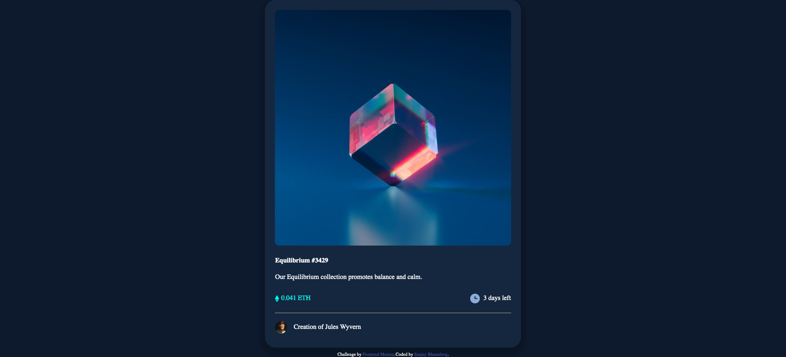
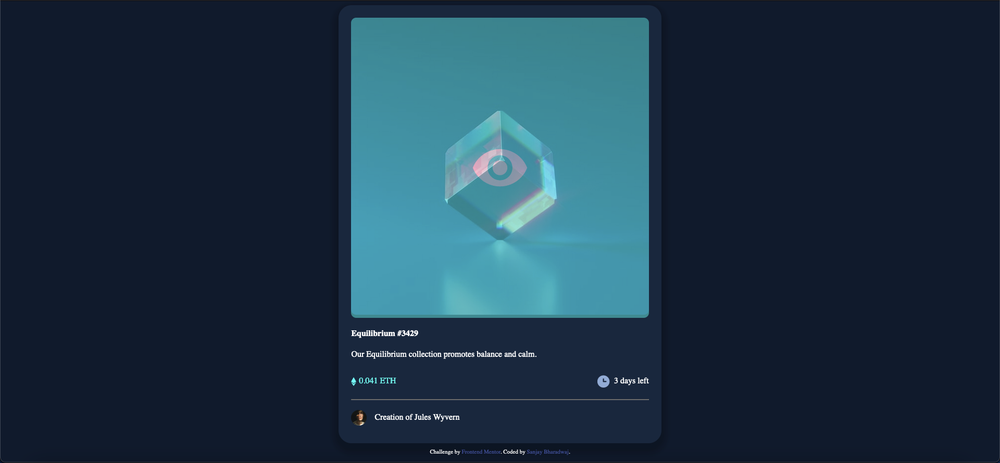

# Frontend Mentor - NFT preview card component solution

This is a solution to the [NFT preview card component challenge on Frontend Mentor](https://www.frontendmentor.io/challenges/nft-preview-card-component-SbdUL_w0U). Frontend Mentor challenges help you improve your coding skills by building realistic projects. 

## Table of contents

- [Overview](#overview)
  - [The challenge](#the-challenge)
  - [Screenshot](#screenshot)
- [My process](#my-process)
  - [Built with](#built-with)
  - [What I learned](#what-i-learned)
  - [Continued development](#continued-development)
  - [Useful resources](#useful-resources)
- [Author](#author)


## Overview

### The challenge

Users should be able to:

- View the optimal layout depending on their device's screen size
- See hover states for interactive elements

### Screenshot




## My process

### Built with

- Semantic HTML5 markup
- Flexbox
- Responsive Design

**Note: These are just examples. Delete this note and replace the list above with your own choices**

### What I learned

One important concept I learned in this project was active states, especially for images. I learned how to use positioning to overlay images on top of each other. The following CSS was used to create an overlay for the image in the card when hovered on. 

```css
.image {
    position: relative;
}
.overlay {
    /* display: none; */
    background-color: #0ff1e8;
    opacity: 0;
    position: absolute;
    top:0;
    left:0;
    width: 100%;
    height: 100%;
    display: flex;
    align-items: center;
    justify-content: space-around;
    transition: opacity .5s;
    border-radius: 10px;
}
.image:hover .overlay {
    opacity: .5;
}
```
This corresponds to the following HTML5 code.
```html
    <div class="image">
      
      <div class="overlay">
        
      </div>
    </div>
```
These codes combine to create the following effect when hovering on the image:



### Continued development & learning

I'd like to learn more about positioning to help clarify some of the positioning issues I had run into along the way. I hope to use some of the knowledge I gained in this project to help me create hover cards in my own future projects.  

### Useful resources

- [W3 Schools](https://www.w3schools.com) - Their articles on several CSS concepts such as Box Shadowing helped me with the styling used in this project. 
- Kevin Powell's Conquering Responsive Layouts Course helped me get a strong understanding of flexbox and its various properties which I used.
- Web Dev Simplified's [youtube](https://www.google.com/url?sa=t&rct=j&q=&esrc=s&source=web&cd=&cad=rja&uact=8&ved=2ahUKEwjz_ZK9-630AhUzO30KHUljDMkQwqsBegQIAxAB&url=https%3A%2F%2Fwww.youtube.com%2Fwatch%3Fv%3Djx5jmI0UlXU&usg=AOvVaw05-mcMxRgXinlRZjFQv5-l) video on CSS positioning. This helped me use absolute positioning for the overlay image. 


## Author

- Frontend Mentor - [@SanjayB06](https://www.frontendmentor.io/profile/SanjayB06)
